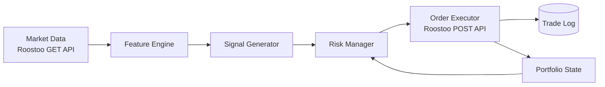

<div align="center">

# 🤖 YOUR BOT NAME

**An autonomous quant trading bot for the HK vs AU vs IN Quant Trading Hackathon**

[](https://www.python.org/)
[](https://aws.amazon.com/ec2/)
[](https://github.com/roostoo/Roostoo-API-Documents)
[](LICENSE)

[Overview](#-overview) • [Strategy](#-strategy) • [Architecture](#-architecture) • [Quick Start](#-quick-start) • [Deployment](#-deployment) • [Risk Management](#-risk-management) • [Team](#-team)

</div>

---

## 📌 Overview

**YOUR BOT NAME** is a fully autonomous spot-trading bot built for the **HK vs AU vs IN Quant Trading Hackathon**, powered by **Susquehanna** and **Roostoo Labs**. It makes buy, hold, and sell decisions on Roostoo's real-time mock exchange with **zero manual intervention**.

> 🎯 **Objective:** maximize portfolio return while minimizing risk, measured by **Sortino**, **Sharpe**, and **Calmar** ratios.

| | |
|---|---|
| 🏫 **University** | `YOUR UNIVERSITY` (e.g. IIT Kanpur) |
| 🌏 **Region** | `India` |
| 👥 **Team** | `YOUR TEAM NAME` |
| 💰 **Starting Capital** | $100,000 (mock) |
| 📈 **Market** | Spot only, 1x, no leverage |

---

## ✨ Highlights

- 🧠 **Strategy type:** rule-based **mean reversion** (rolling z-score, long-only spot)
- ⚙️ **Fully autonomous:** every order is placed by code through the Roostoo API
- 🛡️ **Built-in risk controls:** position sizing, stop-loss, exposure caps
- 🧾 **Complete logging:** every trade and API response is recorded
- ☁️ **Runs 24/7** on an AWS EC2 instance
- 🔁 **Clean commit history:** all strategy changes are traceable

---

## 🧠 Strategy

**Mean reversion on rolling z-scores.** Every minute the bot samples the price of each pair and measures how far it sits from its recent average, in standard deviations (the *z-score*). Prices that stretch far below their average tend to snap back, so the bot buys the dip and sells when price returns to the mean.

| | Rule | Default |
|---|---|---|
| 🟢 **Entry** | z-score ≤ −`ENTRY_Z` **and** distance to mean ≥ `MIN_EDGE_PCT` | `−1.5`, `0.3%` |
| 🔴 **Exit (target)** | z-score ≥ `EXIT_Z` (price is back at its average) | `0.0` |
| 🛑 **Exit (stop-loss)** | price falls `STOP_LOSS_PCT` below entry | `3%` |
| ⏱️ **Exit (time stop)** | trade hasn't reverted after `MAX_HOLD_MINUTES` | `360` min |
| 📏 **Lookback** | `WINDOW` samples × `POLL_SECONDS` | 60 × 60s = 1 hour |

> 💡 **Why the edge filter?** Each round trip costs ~0.2% in taker fees (0.1% × 2). The bot only enters when the expected move back to the mean is large enough to pay for that.

The bot needs one full window of data (about an hour) after a cold start before it trades. Price history is saved to `data/price_history.csv`, so restarts keep their warm-up.

---

## 🏗️ Architecture



### 📁 Project Structure

```
.
├── main.py                       # Entry point - wires everything together
├── app/
│   ├── bot.py                    # Trading loop: data → signal → risk → order
│   ├── roostoo_client.py         # Signed Roostoo API client (logs every request)
│   └── paper_client.py           # Paper-trading client for --dry-run
├── strategy/
│   └── mean_reversion.py         # Z-score mean-reversion signals
├── risk_management/
│   └── risk_manager.py           # Position sizing, stop-loss, order throttling
├── data_preprocessing/
│   ├── price_buffer.py           # Rolling price history (persisted to CSV)
│   └── features.py               # Rolling mean / std / z-score
├── misc/
│   ├── config.py                 # All settings (env vars / .env)
│   ├── logger.py                 # Console + file + CSV logging
│   ├── state.py                  # Remembers entry prices across restarts
│   ├── utils.py                  # Rounding / formatting helpers
│   ├── setup_ec2.sh              # One-shot AWS EC2 setup
│   └── quantbot.service          # systemd unit (auto-restart)
├── requirements.txt
├── .env.example
└── README.md
```

Runtime output (git-ignored): `logs/trades.csv`, `logs/api_log.csv`, `logs/bot.log`, `data/price_history.csv`, `data/state.json`.

---

## 🚀 Quick Start

### Prerequisites

- Python 3.9+
- Roostoo API key + secret (provided by the organizers)

### Installation

```bash
git clone https://github.com/YOUR_USERNAME/YOUR_REPO.git
cd YOUR_REPO

python -m venv venv
source venv/bin/activate        # Windows: venv\Scripts\activate
pip install -r requirements.txt
```

### Configuration

```bash
cp .env.example .env
```

```env
ROOSTOO_API_KEY=your_api_key
ROOSTOO_API_SECRET=your_api_secret
```

All strategy and risk parameters are also set in `.env` (see [`.env.example`](.env.example)).

> ⚠️ Never commit your `.env` file or API keys. It is already in `.gitignore`.

### Run

```bash
python main.py --dry-run --once   # smoke test: one cycle, paper trading, no orders sent
python main.py --dry-run          # paper trade with real Roostoo prices
python main.py                    # LIVE trading on Roostoo
```

---

## ☁️ Deployment

The bot runs 24/7 on the **AWS EC2** instance provided for the hackathon.

```bash
git clone https://github.com/YOUR_USERNAME/YOUR_REPO.git && cd YOUR_REPO
bash misc/setup_ec2.sh            # installs Python, venv, requirements, systemd service
nano .env                         # add your API key and secret
sudo systemctl start quantbot     # start trading (auto-restarts, survives reboots)
journalctl -u quantbot -f         # watch live logs
```

<details>
<summary><b>Useful commands</b></summary>

```bash
sudo systemctl status quantbot    # is it running?
sudo systemctl restart quantbot   # apply new .env settings
sudo systemctl stop quantbot      # stop the bot
tail -f logs/trades.csv           # every order placed
tail -f logs/api_log.csv          # every API request + success/failure
```

</details>

---

## 🛡️ Risk Management

| Control | Default | Setting |
|---|---|---|
| Max position size | 10% of equity per pair | `MAX_POSITION_PCT` |
| Max total exposure | 50% of equity | `MAX_EXPOSURE_PCT` |
| Stop-loss | 3% below entry | `STOP_LOSS_PCT` |
| Time stop | 6 hours | `MAX_HOLD_MINUTES` |
| Buy throttle | 10s between buys | `MIN_SECONDS_BETWEEN_BUYS` |
| Daily order cap | 300 orders | `MAX_ORDERS_PER_DAY` |
| Order type | Market (taker, 0.1% fee) | - |

**Competition constraints respected:**

- ✅ Spot trading only, long-only, no leverage
- ✅ No high-frequency, market-making, or arbitrage (one cycle per minute, a few requests each)
- ✅ Fees accounted for: **0.1% taker**, built into the entry edge filter
- ✅ Orders are never auto-retried, so no duplicate trades after a network error
- ✅ Order sizes rounded down to each pair's exchange precision and minimum
- ✅ Every order and API request logged for the trade-log integrity check
- ✅ Fully autonomous: no manual API calls

---

## 📈 Performance

> Update with your live results from the competition leaderboard.

| Metric | Value |
|---|---|
| Portfolio Return | `--%` |
| Sortino Ratio | `--` |
| Sharpe Ratio | `--` |
| Calmar Ratio | `--` |
| Max Drawdown | `--%` |
| Total Trades | `--` |

> 🧮 Composite score used by judges: **0.4 × Sortino + 0.3 × Sharpe + 0.3 × Calmar**

---

## 🗺️ Roadmap

- [x] Core trading loop
- [x] Risk manager
- [x] AWS deployment
- [ ] Backtesting on collected `price_history.csv`
- [ ] Per-pair parameter tuning
- [ ] Volatility-scaled position sizing
- [ ] Drawdown circuit breaker

---

## 👥 Team

| Name | Role | GitHub |
|---|---|---|
| `Your Name` | Strategy & Development | [@username](https://github.com/username) |
| `Teammate` | Infrastructure | [@username](https://github.com/username) |

---

## 🔗 Resources

- 📅 [Hackathon Page](https://luma.com/coghwiyt)
- 📘 [Roostoo API Documentation](https://github.com/roostoo/Roostoo-API-Documents)
- 📱 [Roostoo Web App](https://app.roostoo.com/)

---

## ⚠️ Disclaimer

This project was built for an educational hackathon using a **mock trading environment**. It is not financial advice, and nothing here should be used for real-money trading without independent testing and risk review.

---

<div align="center">

**Built for the HK vs AU vs IN Quant Trading Hackathon** 🏆

⭐ Star this repo if you found it useful!

</div>
