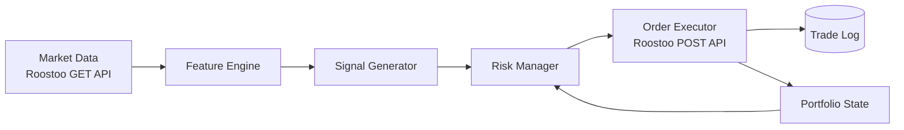

# 🤖 Fourier Falcons Bot

**An autonomous quant trading bot for the HK vs AU vs IN Quant Trading Hackathon**

[](https://www.python.org/)
[](https://aws.amazon.com/ec2/)
[](https://github.com/roostoo/Roostoo-API-Documents)
[](LICENSE)

[Overview](#-overview) • [Strategy](#-strategy) • [Architecture](#-architecture) • [Quick Start](#-quick-start) • [Deployment](#-deployment) • [Risk Management](#-risk-management) • [Team](#-team)

</div>

---

## 📌 Overview

**YOUR BOT NAME** is a fully autonomous spot-trading bot built for the **HK vs AU vs IN Quant Trading Hackathon**, powered by **Susquehanna** and **Roostoo Labs**. It makes buy, hold, and sell decisions on Roostoo's real-time mock exchange with **zero manual intervention**.

> 🎯 **Objective:** maximize portfolio return while minimizing risk, measured by **Sortino**, **Sharpe**, and **Calmar** ratios.

| | |
|---|---|
| 🏫 **University** | `YOUR UNIVERSITY` (e.g. IIT Kanpur) |
| 🌏 **Region** | `India` |
| 👥 **Team** | `YOUR TEAM NAME` |
| 💰 **Starting Capital** | $100,000 (mock) |
| 📈 **Market** | Spot only, 1x, no leverage |

---

## ✨ Highlights

- 🧠 **Strategy type:** `[rule-based / ML / RL / LLM / hybrid]`
- ⚙️ **Fully autonomous:** every order is placed by code through the Roostoo API
- 🛡️ **Built-in risk controls:** position sizing, stop-loss, exposure caps
- 🧾 **Complete logging:** every trade and API response is recorded
- ☁️ **Runs 24/7** on an AWS EC2 instance
- 🔁 **Clean commit history:** all strategy changes are traceable

---

## 🧠 Strategy

> Describe your edge in 3-5 sentences. Judges review code quality *and* strategy clarity.

**Core idea:** `Explain what market inefficiency or pattern you exploit.`

<details>
<summary><b>📊 Signals & Indicators</b></summary>

| Signal | Description | Weight / Role |
|---|---|---|
| `Signal 1` | e.g. EMA crossover on 1h candles | Entry trigger |
| `Signal 2` | e.g. RSI filter | Confirmation |
| `Signal 3` | e.g. ATR-based volatility | Position sizing |

</details>

<details>
<summary><b>🎯 Entry & Exit Logic</b></summary>

- **Entry:** `condition`
- **Exit:** `condition`
- **Stop-loss:** `X%`
- **Take-profit:** `Y%`
- **Rebalance frequency:** `every N minutes/hours`

</details>

<details>
<summary><b>🔬 Why it works</b></summary>

`Your reasoning, backtest results, or research references.`

</details>

---

## 🏗️ Architecture



### 📁 Project Structure

```
.
├── bot/
│   ├── main.py            # Entry point / main loop
│   ├── strategy.py        # Signal generation
│   ├── risk.py            # Position sizing & risk limits
│   ├── executor.py        # Roostoo API order handling
│   └── logger.py          # Trade & API logging
├── config/
│   └── config.yaml        # Strategy parameters
├── logs/                  # Trade logs (auto-generated)
├── tests/
├── requirements.txt
├── .env.example
└── README.md
```

> ✏️ Update the tree above to match your actual repo.

---

## 🚀 Quick Start

### Prerequisites

- Python 3.10+
- Roostoo API credentials (provided by organizers)
- AWS EC2 instance (provided via hackathon sub-account)

### Installation

```bash
# Clone the repo
git clone https://github.com/YOUR_USERNAME/YOUR_REPO.git
cd YOUR_REPO

# Create a virtual environment
python -m venv venv
source venv/bin/activate        # Windows: venv\Scripts\activate

# Install dependencies
pip install -r requirements.txt
```

### Configuration

```bash
cp .env.example .env
```

```env
ROOSTOO_API_KEY=your_api_key
ROOSTOO_API_SECRET=your_api_secret
```

> ⚠️ Never commit your `.env` file or API keys.

### Run

```bash
python -m bot.main
```

---

## ☁️ Deployment

The bot runs continuously on an **AWS EC2** instance.

```bash
# Keep the bot alive with tmux
tmux new -s bot
python -m bot.main
# Detach: Ctrl+B, then D
```

<details>
<summary><b>Optional: run as a systemd service</b></summary>

```ini
[Unit]
Description=Quant Trading Bot
After=network.target

[Service]
User=ubuntu
WorkingDirectory=/home/ubuntu/YOUR_REPO
ExecStart=/home/ubuntu/YOUR_REPO/venv/bin/python -m bot.main
Restart=always

[Install]
WantedBy=multi-user.target
```

</details>

---

## 🛡️ Risk Management

| Control | Setting |
|---|---|
| Max position size | `X% of portfolio` |
| Max total exposure | `Y%` |
| Stop-loss | `Z%` |
| Max drawdown guard | `N%` |
| Order type | `Market / Limit` |

**Competition constraints respected:**

- ✅ Spot trading only, no leverage
- ✅ No high-frequency, market-making, or arbitrage strategies
- ✅ Fees accounted for: **0.1% taker / 0.05% maker**
- ✅ Rate-limited API calls to avoid failed requests
- ✅ At least 8 active trading days with sufficient trades

---

## 📈 Performance

> Update with your live results from the competition leaderboard.

| Metric | Value |
|---|---|
| Portfolio Return | `--%` |
| Sortino Ratio | `--` |
| Sharpe Ratio | `--` |
| Calmar Ratio | `--` |
| Max Drawdown | `--%` |
| Total Trades | `--` |

> 🧮 Composite score used by judges: **0.4 × Sortino + 0.3 × Sharpe + 0.3 × Calmar**

---

## 🗺️ Roadmap

- [x] Core trading loop
- [x] Risk manager
- [x] AWS deployment
- [ ] `Planned improvement 1`
- [ ] `Planned improvement 2`

---

## 👥 Team

| Name | Role | GitHub |
|---|---|---|
| `Your Name` | Strategy & Development | [@username](https://github.com/username) |
| `Teammate` | Infrastructure | [@username](https://github.com/username) |

---

## 🔗 Resources

- 📅 [Hackathon Page](https://luma.com/coghwiyt)
- 📘 [Roostoo API Documentation](https://github.com/roostoo/Roostoo-API-Documents)
- 📱 [Roostoo Web App](https://app.roostoo.com/)

---

## ⚠️ Disclaimer

This project was built for an educational hackathon using a **mock trading environment**. It is not financial advice, and nothing here should be used for real-money trading without independent testing and risk review.

---

<div align="center">

**Built for the HK vs AU vs IN Quant Trading Hackathon** 🏆

⭐ Star this repo if you found it useful!

</div>